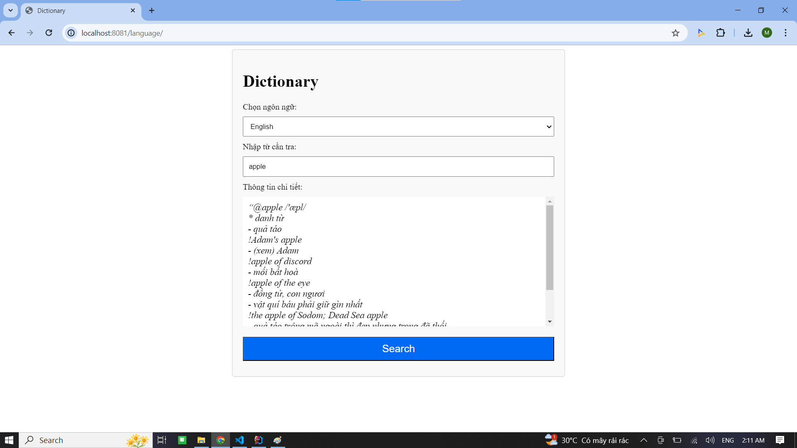
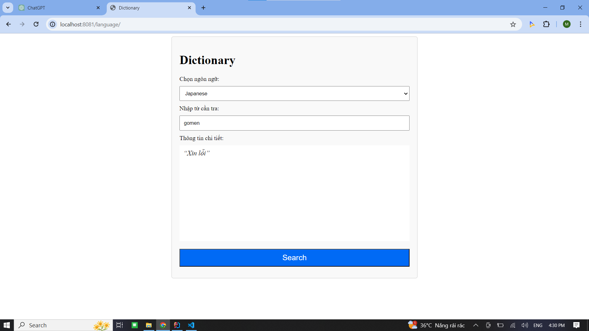
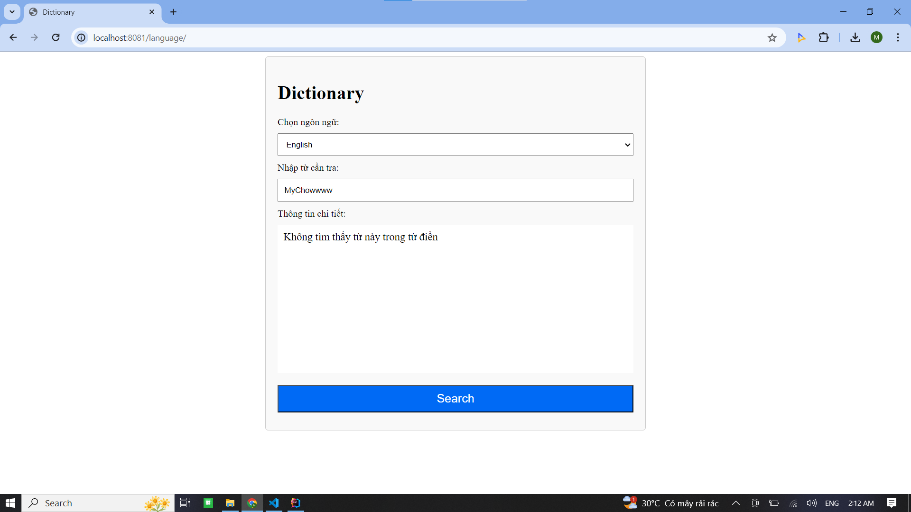
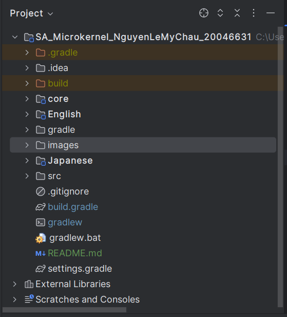
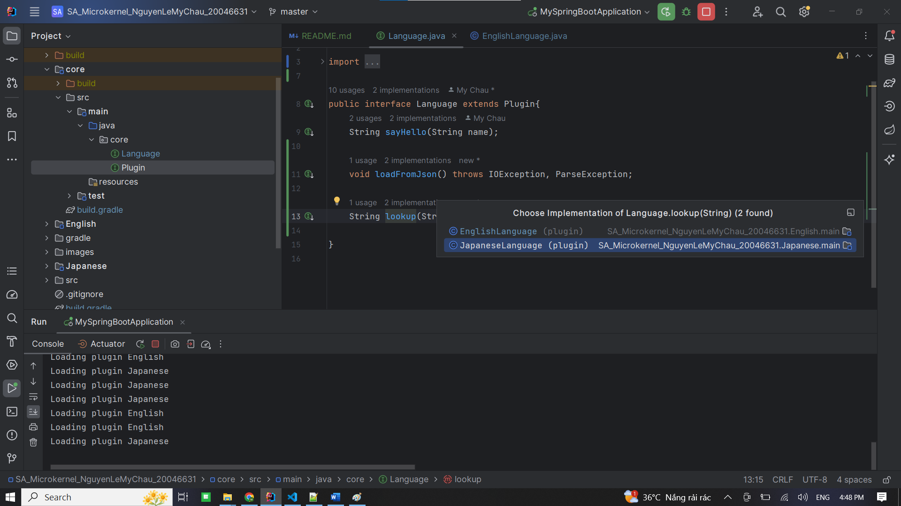
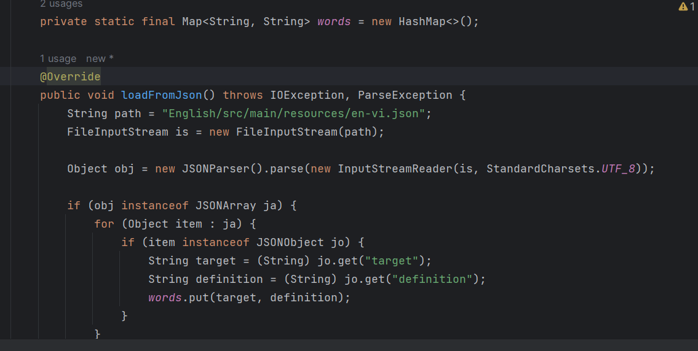
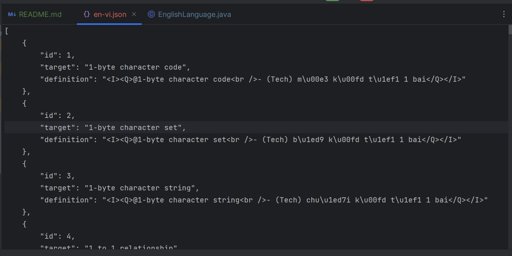
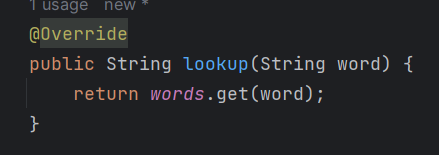

#### Mô tả
Dựa trên kiến trúc microkernel, tạo một kernel cho một từ điển gồm một phương thức tra từ, giao diện bao gồm một textbox cho việc nhập từ cần tra, một textfield khác cho việc hiển thị thông tin tra được của từ cần tra.

Sử dụng cấu trúc Map<K,V> để tra từ.
#### Sử dụng
- JDK: Phiên bản 17.0.10
- Java Spring Boot
- Gradle Groovy
- Nguồn lấy dữ liệu English: https://github.com/HynDuf/dictionary/blob/ui/src/main/resources/sql/dictionary.sql
- Port: 8081

#### Công cụ

#### Giao diện
Nhập từ cần tra và chọn ngôn ngữ, nhấn Search để tra từ. 

Khi từ này có trong dữ liệu, hiển thị lên khung "Thông tin chi tiết"

Khi từ này không có trong dữ liệu, hiển thị "Không tìm thấy từ này trong từ điển"

#### Cấu trúc thư mục

Trong core chứa interface Language và Plugin

Và interface Language được implements bởi plugin như EnglishLanguage hay Japanese Language

Vói loadFromJson() -> Đọc dữ liệu từ file json được chỉ định và nạp nó vào Map<K, V>

Dữ liệu trong tệp JSON là một mảng JSON (JSONArray), trong đó mỗi phần tử là một đối tượng JSON (JSONObject)

Sau khi có Map thì kiểm tra xem từ được truyền vào có tồn tại trong dữ liệu không, từ đó trả về kết quá

